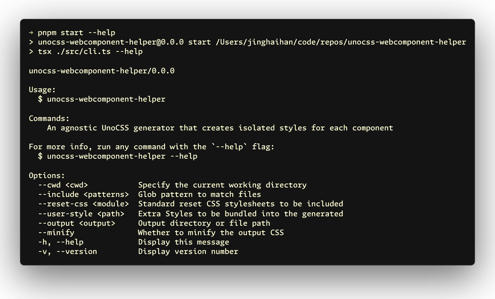

# unocss-webcomponent-helper

[![npm version][npm-version-src]][npm-version-href]
[![bundle][bundle-src]][bundle-href]
[![JSDocs][jsdocs-src]][jsdocs-href]
[![License][license-src]][license-href]

An agnostic UnoCSS generator that creates isolated styles for each component.

> [!IMPORTANT]
> This project was inspired by [@antfu](https://github.com/antfu)'s [starter-vue-webcomponent-uno](https://github.com/antfu/starter-vue-webcomponent-uno).

```sh
pnpm add -D unocss-webcomponent-helper
```

<p align='center'>

</p>

## Usage

```sh
# Basic usage
pnpm unocss-webcomponent-helper

# With options
pnpm unocss-webcomponent-helper --include './src/components/**/*.vue' --output 'src/.generated/css.ts'
```

### CLI Options

- `--cwd` - Specify the current working directory (default: `process.cwd()`)
- `--include` - Glob pattern to match files
- `--reset-css` - Standard reset CSS stylesheets to be included (default: `@unocss/reset/tailwind.css`)
- `--user-style` - Extra styles to be bundled into the generated CSS
- `--output` - Output directory or file path (default: `src/.generated/css.ts`)
- `--minify` - Whether to minify the output CSS (default: `true`)

## Configuration

Create a `uno-webcomp.config.ts` file in your project root:

```typescript
import { defineConfig } from 'unocss-webcomponent-helper'

export default defineConfig({
  include: ['./src/components/**/*.vue'],
  // Reset CSS stylesheets
  resetCSS: '@unocss/reset/tailwind.css',
  // This will be injected into css output
  userStyle: `./src/style.css`,

  // Compose css to a single file
  output: 'src/.generated/css.ts',

  // Output to a directory with a file for each component
  output: 'src/.generated',

  minify: true,
  targets: {
    chrome: 100,
  }
})
```

## Why ?

I want to use [UnoCSS](https://github.com/unocss/unocss) to build components, but atomic CSS can cause conflicts with the host application's styles. Therefore, I hope to achieve isolation through shadow DOM. After [@antfu](https://github.com/antfu) recommended the [starter-vue-webcomponent-uno](https://github.com/antfu/starter-vue-webcomponent-uno) project, I realized that the CSS build implementation could be made into a separate library. Perhaps it can also be applied to web extension builds in the future?

## License

[MIT](./LICENSE) License © [jinghaihan](https://github.com/jinghaihan)

<!-- Badges -->

[npm-version-src]: https://img.shields.io/npm/v/unocss-webcomponent-helper?style=flat&colorA=080f12&colorB=1fa669
[npm-version-href]: https://npmjs.com/package/unocss-webcomponent-helper
[npm-downloads-src]: https://img.shields.io/npm/dm/unocss-webcomponent-helper?style=flat&colorA=080f12&colorB=1fa669
[npm-downloads-href]: https://npmjs.com/package/unocss-webcomponent-helper
[bundle-src]: https://img.shields.io/bundlephobia/minzip/unocss-webcomponent-helper?style=flat&colorA=080f12&colorB=1fa669&label=minzip
[bundle-href]: https://bundlephobia.com/result?p=unocss-webcomponent-helper
[license-src]: https://img.shields.io/badge/license-MIT-blue.svg?style=flat&colorA=080f12&colorB=1fa669
[license-href]: https://github.com/jinghaihan/unocss-webcomponent-helper/LICENSE
[jsdocs-src]: https://img.shields.io/badge/jsdocs-reference-080f12?style=flat&colorA=080f12&colorB=1fa669
[jsdocs-href]: https://www.jsdocs.io/package/unocss-webcomponent-helper
